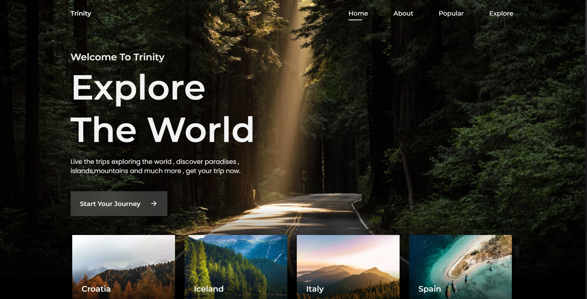
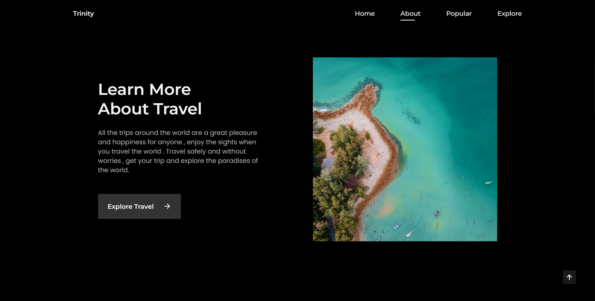
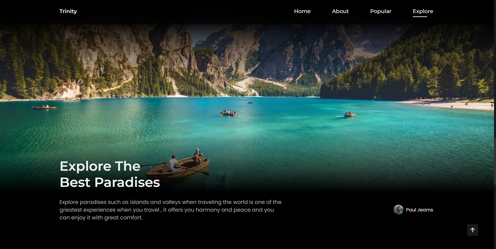

# Travel_website_Responsive

Welcome to the Trinity Travel website ! This is a simple landing page designed using HTML ,css and js to replicate the appearance of travel website.<br>


This website is fully responsive , <br />Responsive for all devices, built using HTML, CSS, and JavaScript.

  <a href="https://trinity-travel-web.netlify.app"><strong>➥ Live Demo</strong></a>

</div>

## Demo Screeshots

[Trinity-Landing-Page Desktop Demo]
<div align="center">
   
   
   
  
</div>

This project is **free to use** and does not contains any license.


## Getting Started

To get a copy of this project up and running on your local machine, follow these steps:

1. Clone the repository:

   ```bash
   git clone https://github.com/your-username/kfc-landing-page.git
